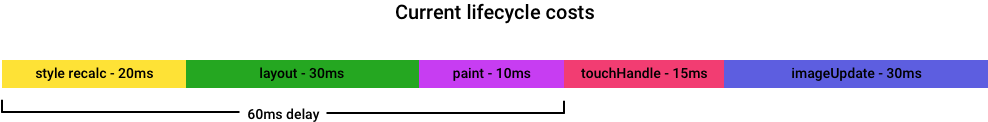
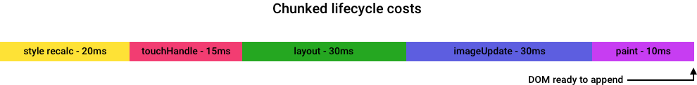

# Make rendering schedulable

Today's DOM operations are synchronous. This pauses scripts and events such as link navigation or touch scrolls.

Scripts that mutate *large* subtrees can create noticeable jank. It's not hard to achieve a 150ms+ delay while trying to mutate the DOM in reasonable ways. If web developers attempt to do pieces of this mutation work across multiple timeouts, they will show partially-constructed DOM, which can be even worse for the user experience than jank.



This spec proposes a way to explicitly declare DOM mutations to be "async", returning immediately with a promise that is fulfilled when the work is done or rejected if the work is invalidated. This API would be a parallel option to the current, synchronous way to mutate DOM.  

A developer could create a subtree to append or build up a set of mutations to be applied to the existing DOM. Once all the DOM mutations were calculated, the developer would pass them to the async API. In the background, a user agent would, at minimum, chunk the resulting work into broad phases yielding back to the event loop between each phase. Based on early investigations, chunking rendering work into broad phases could reduce jank by 30-50% depending on browser.



Later implementations of the API could further chunk each phase until they fit within a frame's spare time. This would essentially make DOM work jank-free. This level of chunking is expected to be difficult, and shouldn't be required for a V0 of the API.

# Constraints
We have heard from several developers that DOM mutations can only be async up to a point. After a certain number of frames, it is better to jank while focusing on render work rather than delay the UI update any further. This API should enable developers to specify how long the async operation is allowed to take before it becomes blocking. 

This API should closely match the way that sites are manipulating DOM today. Large sites and frameworks are much more likely to use the feature if adoption means "feature detect and swap sync mutations for async append if available". If the API requires an entire rewrite of DOM mutation logic, adoption will be low.

Calculating DOM mutations in a worker is a natural thing to pair with async rendering. This API should be relatively unopinionated about input format, so that things like [virtual dom](https://github.com/Matt-Esch/virtual-dom), [`WorkerNode`](github.com/drufball/worker-node), and [`DOMChangeList`](https://github.com/whatwg/dom/issues/270) are all supported.

# Possible API

The shape of the API is not nailed down yet.

A simple possibility is to add "async" versions of all the append methods:

```javascript
interface MutationResult {
  // ... fields related the mutation ...

  // Call commit to make the nodes visually appear. Promise.all() several
  // operations and then commit() together to make them all appear
  // together.
  void commit();
};

partial interface ParentNode {
  Promise<MutationResult> appendAsync((Node or DOMString)... nodes, CancelToken token);
  Promise<MutationResult> prependAsync((Node or DOMString)... nodes, CancelToken token);
  Promise<MutationResult> removeAsync();
  Promise<MutationResult> insertBeforeAsync(Node node, Node? child, CancelToken token);
};
```

Another possibility is to explicitly batch the async operations into a transaction. This makes it possible for the site to make edits to multiple parts of the DOM, and have them all show up at once when they're done preparing, rather than showing up piecemeal:

```javascript
const mutator = new DOMMutator();
// Not married to the name
// Can add options, e.g. new DOMMutator({ priority }), in the future?

for (let i = 0; i < 500; ++i) {
  myTable.appendAsync(mutator, createTableRow());
}

// Call .commit() to signal that you're done batching operations.
// The operations have been running in the background before the commit,
// but they're not allowed to "finish" until the commit happens.
mutator.commit();

// Once .commit() is called, the mutator is "dead" - if you try to use it in any
// further async operations, the operation automatically fails. Throws error?

// Also .cancel() to throw away the whole transaction. Can only be done before
// calling .commit(); ignored/throws after .commit() happens.

// Probably a .ready promise that fulfills when all the operations are complete;
// replaced whenever you add a new operation. Lets you hold off on the .commit()
// until other async operations complete, or lets your provide a cancellation window --
// if you only commit when the appends are finished, you can let the user cancel
// until that last moment.
```

The preceding code adds `async*()` methods to all nodes, and has them take the transaction object as their first argument. An alternative shape is for the transaction object to "wrap" DOM nodes, and just expose the *normal* names for all the append operations:

```javascript
const app = new DOMAsyncAppender();

for (let i = 0; i < 500; ++i) {
  app(myTable).appendChild(createTableRow());
}

app.commit();
```

# What Is Visible Before It Finishes?

An open question is what, if anything, to show between the time the async append is called and the time the operation completes.

* One possibility is to add the nodes to the DOM immediately, but in an "inert" state,
	where they're forced to act like `display: none`,
	and any non-async mutations to the subtree throw
	or maybe cancel the append operation and yank the subtree from the DOM.
* Another is to not add anything to the DOM,
	but keep track of where the subtree would be added,
	and relevant mutations (defined appropriately) again cancel the operation.

# Script Elements

`<script>` elements appended asyncly never run, just like ones added via `innerHTML`.
